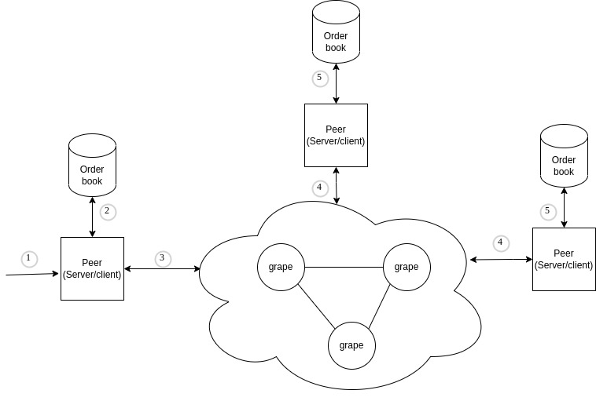

# Simplified Distributed Exchange

This project is about a simplified version of a distributed exchange. Which consists of a peer node that is connected to Granache network, this peer will acts as a server and client in the flow.

## Architecture

## Sequence flow
1. Submit order to one of the peers
2. Peer checks for order matches to settle
    2.a. Match found: Settles matched orders and update order book
    2.b. Partial match found: Settle the partially matched orders (can be one or many) and add the remaining to the order book 
    2.c. No match found: update order book by just adding order
3. Peer submit order to the grape network 'ADD_ORDER'
4. Other peers receive order 
5. Other peers checks for matches to settle 
    5.a. Match found: Settles matched orders and update order book
    5.b. Partial match found: Settle the partially matched orders (can be one or many) and add the remaining to the order book 
    5.c. No match found: update order book by just adding order

## How it works
Start by cloning the project and navigating to the project
```sh
npm i
```
Start the peer by running, you can run multi peers by changing the port number
```sh
PORT=3000 npm start
```


## Missing Things

### Matching engine
The matching engine when it receives a new order, it would look at the order book (ordered by price already) to try to find a match for the order, 3 cases would present:
- Match found: after looking over the order book we select the orders that are equal or cheaper price compared to the new order that we received, we accumulate until we fulfill the asked quantity. We update the matched order with the new status of `SETTLED` and we update the order book
- Partial match found: we update the order by status `PARTIAL` and `SETTLED` for the one that we partially matched with
- No match found: add order to the order book with status `PENDING`
